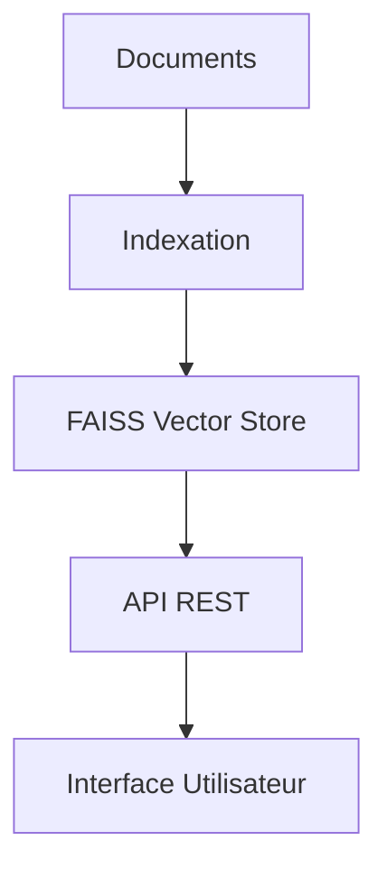

<div align="center">

# 🧠 MémoirePro

[](https://www.python.org/downloads/release/python-311/)
[](https://fastapi.tiangolo.com/)
[](https://github.com/facebookresearch/faiss)
[](https://openai.com/)
[](https://opensource.org/licenses/MIT)
[](http://makeapullrequest.com)

<h3>Système RAG Intelligent pour l'Archivage Numérique et Argentique</h3>

[English](README_EN.md) | [Français](README.md) | [日本語](README_JP.md)

<p align="center">
  
</p>

</div>

---

## 📚 Table des Matières

- [🌟 Points Forts](#-points-forts)
- [🛠️ Installation](#️-installation)
- [🚀 Démarrage Rapide](#-démarrage-rapide)
- [📖 Documentation](#-documentation)
- [🔧 Architecture](#-architecture)
- [🤝 Contribution](#-contribution)
- [📝 License](#-license)

## 🌟 Points Forts

<table>
<tr>
<td>

### 🔍 Recherche Avancée
- Recherche sémantique FAISS
- Indexation multi-format
- Analyse contextuelle

</td>
<td>

### 🎯 Performance
- Optimisé Apple Silicon
- Vectorisation rapide
- Mise en cache intelligente

</td>
</tr>
<tr>
<td>

### 🔐 Sécurité
- Gestion API sécurisée
- Chiffrement des données
- Contrôle d'accès

</td>
<td>

### 🌍 Multilingue
- Support multi-langues
- OCR avancé
- Traduction intégrée

</td>
</tr>
</table>

## 🛠️ Installation

### Prérequis

- Python 3.11+
- Magic Package Manager
- Git

### Installation Simple

```bash
# Cloner le repository
git clone https://github.com/votre-username/memoirepro.git
cd memoirepro

# Installer les dépendances
magic install

# Configuration
cp .env.example .env
```

<details>
<summary>📋 Installation Détaillée</summary>

1. **Configuration système requise**
   ```bash
   # Pour Mac M1/M2
   xcode-select --install
   ```

2. **Installation des dépendances**
   ```bash
   magic shell
   pip install -r requirements.txt
   ```

3. **Configuration de l'environnement**
   ```bash
   # Éditer .env avec vos clés API
   nano .env
   ```
</details>

## 🚀 Démarrage Rapide

```python
from memoirepro import DocumentProcessor

# Initialisation
processor = DocumentProcessor()

# Indexation
processor.index_documents("chemin/vers/documents")

# Recherche
results = processor.search("Votre requête ici")
```

<details>
<summary>🎯 Exemples d'Utilisation API</summary>

### Indexation via API

```bash
curl -X POST http://localhost:8000/index \
  -H "Content-Type: application/json" \
  -d '{
    "input_dir": "~/Documents",
    "output_dir": "./output"
  }'
```

### Recherche via API

```bash
curl -X POST http://localhost:8000/query \
  -H "Content-Type: application/json" \
  -d '{
    "question": "Résumez ce document",
    "top_k": 3
  }'
```
</details>

## 📖 Documentation

| Section | Description |
|---------|-------------|
| [Guide d'Installation](docs/installation.md) | Instructions détaillées d'installation |
| [API Reference](docs/api.md) | Documentation complète de l'API |
| [Exemples](docs/examples.md) | Exemples d'utilisation |
| [FAQ](docs/faq.md) | Questions fréquentes |

## 🔧 Architecture



## 🤝 Contribution

Nous adorons les contributions ! Voici comment participer :

1. 🍴 Forkez le projet
2. 🔧 Créez votre branche (`git checkout -b feature/AmazingFeature`)
3. 💾 Committez vos changements (`git commit -m 'Add AmazingFeature'`)
4. 📤 Pushez vers la branche (`git push origin feature/AmazingFeature`)
5. 🔍 Ouvrez une Pull Request

## 📝 License

MémoirePro est sous licence MIT. Voir le fichier [LICENSE](LICENSE) pour plus de détails.

---

<div align="center">

### ⭐ Supportez le Projet

Si vous trouvez MémoirePro utile, donnez-nous une étoile ⭐

[⬆ Retour en haut](#-memoirepro)

</div>
