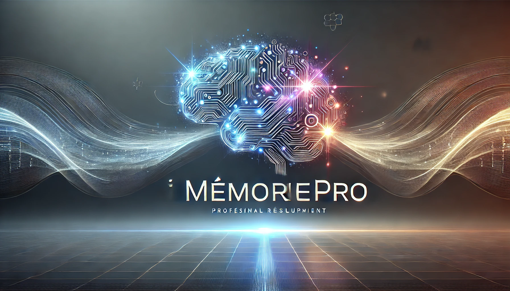
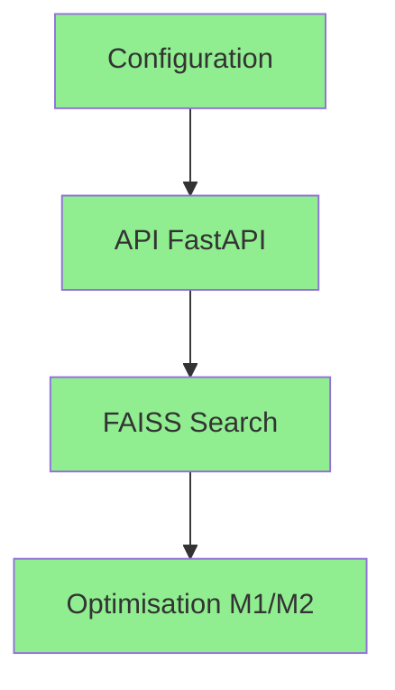
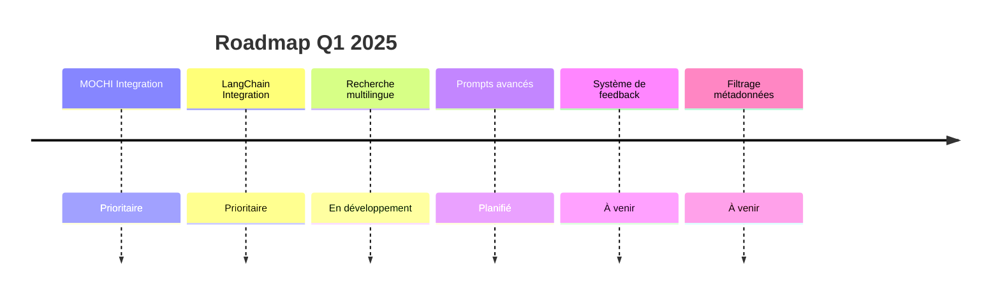
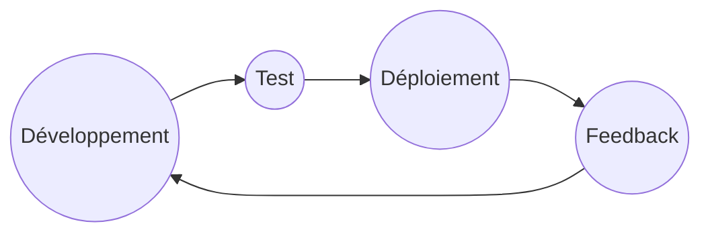

# MémoirePro Roadmap 2025

## Vision
> Créer une solution RAG innovante et performante pour la gestion intelligente des connaissances

## État d'Avancement

### Phase 1: Fondations (Complété)

#### Réalisations Techniques
| Fonctionnalité | État | Description |
|----------------|------|-------------|
| Configuration Pixi | | Environnement de développement optimisé |
| API FastAPI | | Architecture REST performante |
| FAISS Integration | | Recherche vectorielle efficace |
| Multi-format | | Support PDF, DOCX, TXT |
| PromptNode | | Configuration optimisée sans accelerate |

### Tâches Réalisées
- [x] Configuration du projet avec magic/pixi
- [x] Mise en place de l'API FastAPI
- [x] Intégration de FAISS pour la recherche vectorielle
- [x] Support des formats PDF, DOCX, TXT
- [x] Logging détaillé avec Rich
- [x] Optimisation pour Mac M1/M2 (MPS)
- [x] Gestion des variables d'environnement
- [x] Documentation de base (README.md)
- [x] Endpoint d'indexation (/index)
- [x] Endpoint de chargement (/load)
- [x] Endpoint de requête (/query)
- [x] Gestion des erreurs HTTP
- [x] Validation des entrées avec Pydantic

### Phase 2: Innovation (En Cours)

#### Q1 2025 - Amélioration de la Recherche

#### Q2 2025 - Interface Utilisateur
**Design & UX**
- [ ] Interface Web Moderne
- [ ] Visualisation des données
- [ ] Dashboard analytics
- [ ] Thème sombre/clair

#### Q3 2025 - Intégration
**Performance & Scalabilité**
- [ ] API WebSocket
- [ ] Système de plugins
- [ ] Intégration cloud
- [ ] Export multi-format

#### Q4 2025 - Intelligence
**IA & Automatisation**
- [ ] Apprentissage actif
- [ ] Clustering automatique
- [ ] Détection de langue
- [ ] Génération de résumés

### 🎤 Intégration MOCHI (Interface Vocale)
- [ ] Implémentation de la reconnaissance vocale
- [ ] Synthèse vocale pour les réponses
- [ ] Support multilingue pour la voix
- [ ] Interface de commande vocale
- [ ] Transcription en temps réel
- [ ] Personnalisation des voix de sortie

### 🔗 Intégration LangChain
- [ ] Mise en place des chaînes LangChain
- [ ] Configuration des agents LangChain
- [ ] Optimisation des prompts avec LangChain
- [ ] Intégration avec le système de RAG existant

### 📊 Intégration MOCHI et LangChain
#### Q1 2025 - Intégration MOCHI et LangChain

### Métriques de Succès
- Performance: < 500ms par requête
- Précision: > 90% de pertinence
- Satisfaction: > 4.5/5 étoiles

## Cycle de Mise à Jour

---

### Dernière mise à jour: 6 janvier 2025

