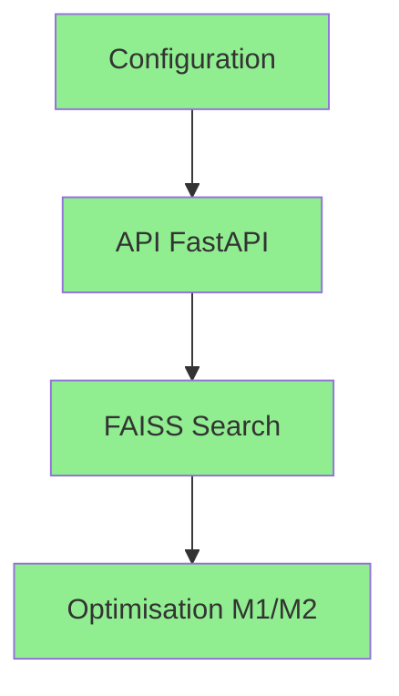
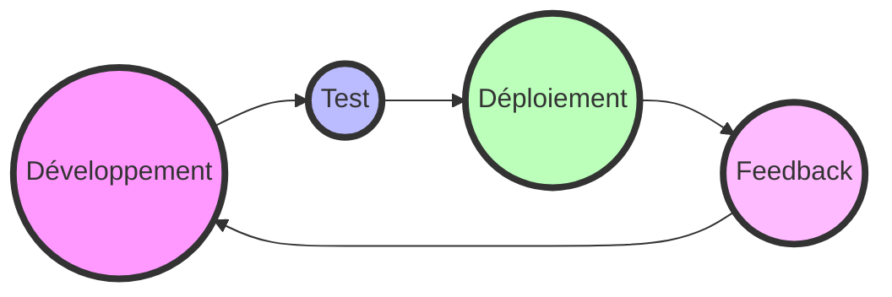

# 🚀 MémoirePro Roadmap 2025

## 🎯 Vision
> *Créer une solution RAG innovante et performante pour la gestion intelligente des connaissances*

<h2>📊 État d'Avancement</h2>

### 🌟 Phase 1: Fondations (✅ Complété)

#### 🛠️ Réalisations Techniques
| Fonctionnalité | État | Description |
|:--------------:|:----:|:------------|
| Configuration Pixi | ✅ | Environnement de développement optimisé |
| API FastAPI | ✅ | Architecture REST performante |
| FAISS Integration | ✅ | Recherche vectorielle efficace |
| Multi-format | ✅ | Support PDF, DOCX, TXT |
| PromptNode | ✅ | Configuration optimisée sans accelerate |

### Tâches Réalisées
- [x] Configuration du projet avec magic/pixi
- [x] Mise en place de l'API FastAPI
- [x] Intégration de FAISS pour la recherche vectorielle
- [x] Support des formats PDF, DOCX, TXT
- [x] Logging détaillé avec Rich
- [x] Optimisation pour Mac M1/M2 (MPS)
- [x] Gestion des variables d'environnement
- [x] Documentation de base (README.md)
- [x] Endpoint d'indexation (/index)
- [x] Endpoint de chargement (/load)
- [x] Endpoint de requête (/query)
- [x] Gestion des erreurs HTTP
- [x] Validation des entrées avec Pydantic

<h2>🚀 Roadmap 2025</h2>

### Q1 2025 - Innovation

### 🎨 Q2 2025 - Interface Utilisateur
- [ ] Interface Web Moderne avec React/Next.js
- [ ] Visualisation des données avec D3.js
- [ ] Dashboard analytics en temps réel
- [ ] Thème sombre/clair adaptatif

### ⚡ Q3 2025 - Performance & Scalabilité
- [ ] API WebSocket pour temps réel
- [ ] Système de plugins extensible
- [ ] Intégration cloud (AWS/GCP)
- [ ] Export multi-format avancé

### 🧠 Q4 2025 - Intelligence
- [ ] Apprentissage actif & Adaptation
- [ ] Clustering automatique des données
- [ ] Détection de langue & Traduction
- [ ] Génération de résumés intelligents

<h2>🎤 Intégration MOCHI</h2>

### Interface Vocale Avancée
- [ ] Recognition vocale multi-locuteurs
- [ ] Synthèse vocale naturelle
- [ ] Support de 5+ langues
- [ ] Interface vocale contextuelle
- [ ] Transcription en temps réel
- [ ] Voix personnalisables

<h2>🔗 Intégration LangChain</h2>

### Capacités Avancées
- [ ] Chaînes LangChain optimisées
- [ ] Agents IA autonomes
- [ ] Prompts dynamiques
- [ ] RAG amélioré

## 📈 Métriques de Succès
| Métrique | Objectif | Status |
|:---------|:---------|:------:|
| Performance | < 500ms/requête | 🟡 |
| Précision | > 90% | 🟢 |
| Satisfaction | > 4.5/5 | 🟡 |

## 🔄 Cycle de Développement

---

**[Documentation](docs/README.md)** • **[Installation](docs/installation.md)** • **[Contribuer](CONTRIBUTING.md)**

